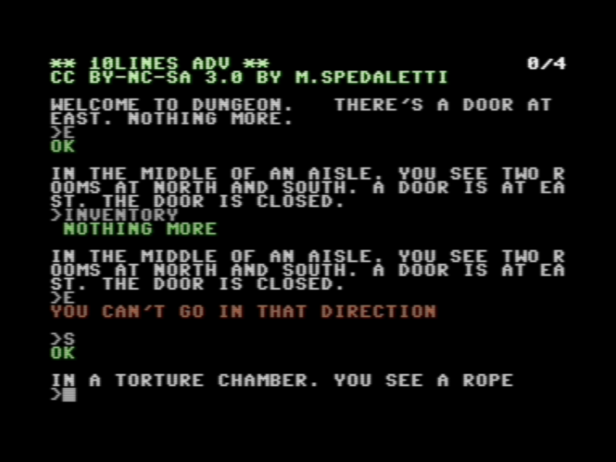

# 10LINES ADV

**10LINES ADV** is an adventure game for [COMMODORE 64](https://it.wikipedia.org/wiki/Commodore_64) home computer. In this game the player assumes the role of a protagonist in an interactive story, driven by exploration and puzzle-solving. This game is designed for a single player, it is text-based and uses a text parser to translate the player's input into commands.

[Click here](https://github.com/spotlessmind1975/adv10en/blob/master/adv10-all-20200202.d64) to download the disk image (D64 format). 
The image contains both English and [Italian edition](https://github.com/spotlessmind1975/adv10).

This game was created to participate in the ["BASIC10Liner" competition 2020](https://gkanold.wixsite.com/homeputerium/2020). For this reason, the game is modest in size (even if it has a couple of puzzles), the given source code respects strong constraints on the length of each line (category: **EXTREME-256**) and it does not rely on third party libraries. For those interested, the Italian edition is also available.

For those wishing to deepen the details of its implementation (**ATTENTION: SPOILERS!**), please refer to the following documents:
 *  [the commented source code](/docs/source.md)
 *  [the parser](/docs/parser.md)
 *  [internal state of the game](/docs/game-state.md)
 *  [the compression method](/docs/compression.md)

For those who are stuck, find suggestions [on this page](docs/suggestions.md).
Here you will find the [complete solution](docs/solution.md).