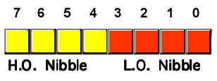

# TEXT COMPRESSION

One of the most "bulky" elements of the programs written in BASIC V2 are certainly the texts: error messages, descriptions, labels, prompts ... everything must be strongly reduced in order to save precious space for the rest of the program. This applies to both more and less serious applications, such as games, and it becomes critical in those games where texts are essential. 

I am referring, of course, to the so-called "text adventures" and it would be fantastic if we found a way to represent texts in a more "compact" way.

The best way to solve this problem in general is to take into consideration the low variability of the letters and, therefore, to use a nibble representation (4 bit) instead of a byte (8 bit).

This approach would ideally reduce the occupation of space to exactly half of what is needed today. Obviously, we can represent only 16 symbols (0...15), which are insufficient to completely represent all the letters of the alphabet, and one punctuation mark (28 letters: a-z, the full stop "." and the space). 

But, if we assigned the letters that are most frequent in that text to these 16 symbols, **we would statistically reduce the occupation** since we will use more frequently a nibble instead of a byte. 

In order to be able to encode any generic text, we must sacrifice some of the representable values to introduce a way to return (temporarily) to the 8-bit representation, when we need it.

To give an example, I will take the following text from [10lines adv (English edition)](https://github.com/spotlessmind1975/adv10en):

> IN THE MIDDLE OF AN AISLE. YOU SEE TWO ROOMS AT NORTH AND SOUTH. A DOOR IS AT EAST.

This string is exactly 83 characters long and it has 17 different letters. If we represent it using 8 bit chars, it would occupy exactly 83 bytes.

<table>
    <tr>
        <td>"I"</td>
        <td>"N"</td>
        <td>(spazio)</td>
        <td>"T"</td>
        <td>"H"</td>
        <td>"E"</td>
        <td>...</td>
    </tr>
    <tr>
        <td>7</td>
        <td>6</td>
        <td>F</td>
        <td>2</td>
        <td>9</td>
        <td>5</td>
        <td>...</td>
    </tr>
</table>

Now, we suppose to use the following correspondence table. I built this table by ordering the letters from the most frequent to the least one in that text:

<table>
    <tr>
        <th>LETTER</th>
        <th>DECIMAL (4 bit)</th>
        <th>HEXADECIMAL (4 bit)</th>
    </tr>
    <tr>
        <td>"o"</td>
        <td>1</td>
        <td>1</td>
    </tr>
    <tr>
        <td>"t"</td>
        <td>2</td>
        <td>2</td>
    </tr>
    <tr>
        <td>"a"</td>
        <td>3</td>
        <td>3</td>
    </tr>
    <tr>
        <td>"s"</td>
        <td>4</td>
        <td>4</td>
    </tr>
    <tr>
        <td>"e"</td>
        <td>5</td>
        <td>5</td>
    </tr>
    <tr>
        <td>"n"</td>
        <td>6</td>
        <td>6</td>
    </tr>
    <tr>
        <td>"i"</td>
        <td>7</td>
        <td>7</td>
    </tr>
    <tr>
        <td>"d"</td>
        <td>8</td>
        <td>8</td>
    </tr>
    <tr>
        <td>"h"</td>
        <td>9</td>
        <td>9</td>
    </tr>
    <tr>
        <td>"."</td>
        <td>10</td>
        <td>A</td>
    </tr>
    <tr>
        <td>"r"</td>
        <td>11</td>
        <td>B</td>
    </tr>
    <tr>
        <td>"l"</td>
        <td>12</td>
        <td>C</td>
    </tr>
    <tr>
        <td>"m"</td>
        <td>13</td>
        <td>D</td>
    </tr>
    <tr>
        <td>(escape)</td>
        <td>14</td>
        <td>E</td>
    </tr>
    <tr>
        <td>(spazio)</td>
        <td>15</td>
        <td>F</td>
    </tr>
</table>

Now let's take up the previous text and express it by using the hexadecimal numbers from the previous frequency table: 

<table>
    <tr>
        <td>"I"</td>
        <td>"N"</td>
        <td>(spazio)</td>
        <td>"T"</td>
        <td>"H"</td>
        <td>"E"</td>
        <td>...</td>
    </tr>
    <tr>
        <td>7</td>
        <td>6</td>
        <td>F</td>
        <td>2</td>
        <td>9</td>
        <td>5</td>
        <td>...</td>
    </tr>
</table>

Since all these numbers can be represented with only one nibble (4 bit), they can be "grouped" in a single byte each two nibbles (8 bit):

<table>
    <tr>
        <td>"IN"</td>
        <td>(spazio) "T"</td>
        <td>"HE"</td>
        <td>...</td>
    </tr>
    <tr>
        <td>76</td>
        <td>F2</td>
        <td>95</td>
        <td>...</td>
    </tr>
</table>

The text "in the", which previously occupied 6 bytes, after the "process" occupies only 3 bytes. **We therefore saved 50% of the space!**

If the letter is not among those of the correspondence, we need of an additional value, the (escape) value (14, hex. E). This value represents an "escape sequence", and it indicates that the letter will not be represented with a nibble but with the subsequent byte.

In the example above, if we had to translate "of" we would have had the following sequence: 

<table>
    <tr>
        <td>"O"</td>
        <td>"F"</td>
        <td></td>
        <td></td>
        <td>...</td>
    </tr>
    <tr>
        <td>1</td>
        <td>E</td>
        <td>4</td>
        <td>F</td>
        <td>...</td>
    </tr>
</table>

So: 2 bytes for 2 bytes, and obviously there is no savings.

It can happen that there are two letters that cannot be translated into a sequence. In this case, we will have **TWO** escape sequences and two characters in the queue: therefore 3 bytes for 2 bytes, and we will have a loss.

I.e.:

<table>
    <tr>
        <td>"F"</td>
        <td>"F"</td>
        <td></td>
        <td></td>
        <td></td>
        <td></td>
        <td>...</td>
    </tr>
    <tr>
        <td>E</td>
        <td>E</td>
        <td>4</td>
        <td>F</td>
        <td>4</td>
        <td>F</td>
        <td>...</td>
    </tr>
</table>

Take note of the fact that the nibble with value 0 is excluded, in order to avoid that a double sequence of this value could emit an invalid output byte (equal to 0). In general, some sequences may not be valid on the target system, and therefore they must be replaced with a double "EE" nibble, followed by the two characters "as is". One such case is the quote character (") on COMMODORE 64, that is used to enclose a string.

In order to evaluate how much saving we could reach in applying this compression schema, we must verify the relationship between the space occupied by all the elements needed to reconstruct the text with respect to the length of the original text. Obviously, being dependent on the content of the text, **it is not possible to give a deterministic measure of the space reduction ratio**. We can, however, present a (pessimistic) estimate model that takes into account the following conditions:

 - **that 50% of the text** can be encoded by a sequence of 2 nibble (2 bytes to 1 bytes);
 - **that 40% of the text** can be encoded by a sequence of 1 nibble ad an escape sequence (2 bytes to 2 bytes);
 - **that 10% of the text** can be encoded by a sequence of two escape sequence (2 bytes to 3 bytes).

This graph shows the compression ratio trend in function of the input text, with the rules set out above about the content.

The trend of the graph with the various lengths presents a balance point around 70-90 characters, and it improves markedly with increasing length of the texts (x axis is in logarithmic scale).

For example, with a text of 256 characters, a saving of 46 characters is obtained, so reaching a compress ratio of about 86%. With 1 KB of text you get a ratio of 81% and a net saving of 190 characters. In reality, **the savings are greater and that makes the use of this technique very advantageous**, especially if texts can be modified to optimize the content.

In order to make this algorithm reusable, the decoder has been implemented **as a single line of BASIC V2 code** of exactly 251 characters. This routine is located on line 9 of the **adv10en** program and it can be called as subroutine (<code>GOSUB 9</code>), as long as you use <code>RETURN</code> in the following lines.

You must pass:
- in **v$** the letter's dictionary (a string of 16 characters);
- in **e$** the byte sequence to decompress;
- in **f** the length of the byte sequence;
- in **z** the starting char to be decompressed.

The commented routine follows, where the "in one line" techniques have been abandoned in favor of better readability:

<pre><code>50 REM *************************************************************************
51 REM *** NIBBLE DECOMPRESSOR (BASIC V2) by m.spedaletti (asimov@mclink.it)
52 REM *************************************************************************
53 REM *** UTILIZZO:
54 REM ***   v$ = dictionary (16 symbols, used only first 13)
55 REM ***   e$ = byte sequence to decode
56 REM ***   f  = length of sequence to decode
57 REM ***   z  = first position to decode
58 REM ****************************************************************************
59 REM
60 REM ESEMPIO (tratto da "adv10en.bas")
61 v$="eoatnsidrh.lcumy"
62 e$="{087}{079}{026}{239}{077}{135}{200}{241}{226}{070}{063}{245}{115}{198}{177}{239}{089}{226}{085}{111}{017}{079}{046}{087}{159}{238}{079}{079}{110}{077}{063}{244}{037}{073}{250}{083}{248}{038}{078}{085}{186}{063}{143}{238}{079}{079}{249}{103}{063}{244}{049}{070}{235}{032}"
63 f=len(e$)
64 z=1
65 GOSUB 100
66 END
100 REM NIBBLE DECOMPRESSOR
110 REM Take z-nth character to decode
120 w$=mid$(e$,z,1)+e$
130 REM Convert it into a byte
140 y=asc(w$)
150 REM Extract two nibbles
160 n0=yand15:n1=(y/16)and15
170 REM Are they a space?
180 s0=(n0=15):s1=(n1=15)
190 REM Are they an escape sequence?
200 v0=(n0=14):v1=(n1=14)
210 REM Are they a letter?
220 l0=(n0<14):l1=(n1<14)
230 REM Print first and second nibble
240 if v0 then print mid$(e$,z+1,1); REM first = escape
250 if s0 then print " "; REM first = space
260 if l0 then print mid$(v$,n0,1); REM first = letter
270 if v1 then print mid$(e$,z+(v0=0)+2,1); REM second = escape
280 if s1 then print " "; REM second = space
290 if l1 then print mid$(v$,n1,1); REM second = letter
300 REM Go on on sequence, taking care that each escape
310 REM sequence means to go on by one additional byte.
320 REM So we could go ahead from 1 to 3 bytes.
330 z=z-v0-v1+1
340 REM Is sequence decoding finished?
350 ifz<=fthen100
360 return
</code>