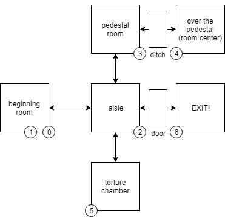
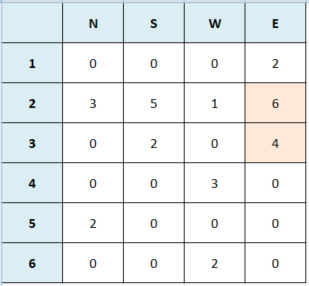
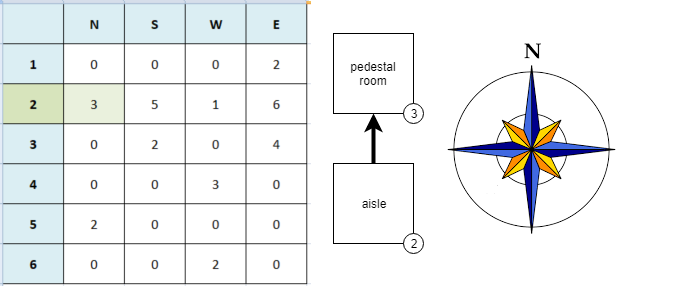
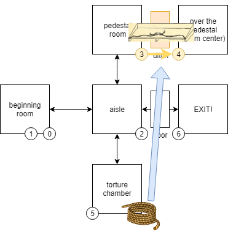

# INTERNAL GAME STATE

**SPOILER ALERT**

By continuing to read, you will become aware of some details of the game, which could preclude a playful experience.

## INTRODUCTION

The state of the game is represented by a set of variables, which describe the salient facts of the game. The variables follow:

- **x**: in which room is the player located? 0-6
- **a**: did the player take the rope? 0 = no, 1 = yes
- **b**: did the player take the key? 0 = no, 1 = yes
- **g**: did the player use the rope in the room with the pedestal? 0 = no, 1 = yes
- **h**: did the player use the key in the aisle with the closed door? 0 = no, 1 = yes

## THE CURRENT ROOM (x)

The room where the player is located (**x**) is one of the six rooms of the game, arranged as follows (see map):

* **0-1**: beginning room
* **2**: aisle
* **3**: pedestal room
* **4**: over the pedestal (room center)
* **5**: torture chamber
* **6**: exit!

The repetition of room "beginning room" for values 0 and 1 is needed to make a different description of the room. The difference is between the first time it is displayed to the player and the next one, and it lies entirely in the starting point of description decoding. This technique allows to add and additional level of compression on descriptions. It is used also in other parts of the game (such as, for example, in the inventory). So, the first time the description of the initial room is displayed, the room number is automatically changed from 0 to 1 (**x = 1**). 

The connections between rooms are described by a single matrix of 6 rows by 4 columns, linearized as a string in the variable **m$**. A row of 4 digits represents a room, while each column (6 digits) represents the new value of **x** if the user chooses to move (respectively) **N**orth (first digit), **S**outh (second digit), **W**est (third digit) or **E**ast (fourth digit) on each room.

So if the player is in room no. 2 (**x = 2**) and he enters <code>N</code>, the game will take him to room no. 3 (**x = 3**).

Although in the current game all connections are bidirectional, this is not mandatory. It would have been possible to represent, for example, "sliding" into a room from which the player could not exit, thus forcing the player in the path of adventure.

## THE STATUS VARIABLES (a,b,g,h)

We present a different description according to the room in which the player is (see above), and the current status of the other status variables (**a,b,g,h**). To ensure the best possible description of the situation, the state of the game is represented by two related descriptions: 
* **room description**: the situation of the room and describes it in a generic way (driven by the variable **x**);
* **status description**: it represents any additional elements that can change according to the state of the variables (driven by the variable **q**, that is a linear combination of status variables)

Since both descriptions are always present, if there is no status description (**q = 0**) this is represented by a standard message (<code>NOTHING MORE</code>).

## STATUS BASED MOVEMENT CONSTRAINTS 

In addition to explicit movement constraints, such as those induced by the matrix (see above), there are also constraints that are based on the current state variables (orange coloured background).**Those costraints prevent the player from moving to some rooms until certain conditions are met.** This happens, for example, in the aisle room, when a locked door block the player's exit.

State changes intersect with the [parser](parser.md). Infact, once the verb (**v**) and noun (**n**) have been decoded, their values are used to vary the state of the aforementioned variables. This variation is subject to feasibility criteria, that is (i.e.) to being  in the right room or having previously taken possession of other needed objects. Once calculated, the destination room is calculated and the parser will check again the complesive result. If something goes wrong, it will emit an error.

To better understand the mechanism, take the example of the rope object. This object (**o = 1**) is located in room no. 5 (**x = 5**), and it is described on that room when the player enters. If the parser understands that the player has requested to take (**v = 5**) just that object, the game will check if this is possible, with this formula: the rope can only be taken only and only if it has not already been taken (**a = 0**) and the player is in the room. nr. 5 (**x = 5**). 

In short:

<pre>a=-(a=1)+((x=5)*(a=0)*(v=5)*(o=1))</pre>

In the absence of one of those conditions, **the state does not change at all** and, in the absence of possession condition (**a = 1**) when user asked to take (**v = 5**) the rope (**a = 1**), the parser will emit an error. By using the current status variables, the program will block the movement by calculating a 0 for the destination room, if conditions are not met. Again, the parser will emit an error if next room is zero (**x = 0**) when a verb is a movement (**v < 5**).

## THE SCORE

The progress of the game, in terms of interaction with the environment, is represented by a score. **The score depends on the sum of all the states indicated above**. The score, which is drawn in the upper right part of the screen and is updated with each interaction, is declined as follows:
- score at the beginning: **0/4**
- when you take the rope: **1/4**
- when you use the rope (in the right place): **2/4**
- when you take the key: **3/4**
- when you use the key (in the right place): **4/4**
