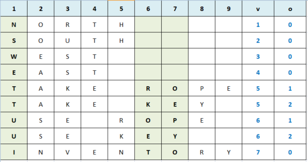

# DEDUCTIVE PARSER

The parser represents one of the greatest difficulties for those who program a text adventure game. Partly because the natural language is ambiguous, and it requires a lot of analysis to understand the intention of the player; a bit because the extreme freedom left to the player determines a great effort in predicting the most frequent interactions.

With few lines available, it was unthinkable to introduce a sophisticated parser. On the other hand, wanting to leave the illusion of a freedom of typing, it was still necessary to manage the most important cases, returning a message of misunderstanding in the negative. The little size of the screenplay made it possible to adopt a deductive input analysis mechanism. It was therefore possible to deduce the set of words to be recognized and their combination. In short, **the presence of certain letters in typing implies the interpretation of those specific commands and actions**.

Below we give the needed set of verbs:

<table>
    <tr>
        <td>NORTH</td>
        <td>SOUTH</td>
        <td>WEST</td>
        <td>EAST</td>
    </tr>
    <tr>
        <td>TAKE</td>
        <td>USE</td>
        <td>INVENTORY</td>
        <td></td>
    </tr>
</table>

Below we give the needed set of nouns:

<table>
    <tr>
        <td>ROPE</td>
        <td>KEY</td>
    </tr>
</table>

This is the combinational matrix of both tables, and it represent the entire set of commands that the parser has to recognize:

<table>
    <tr>
        <td>NORTH</td>
        <td>SOUTH</td>
        <td>WEST</td>
        <td>EAST</td>
    </tr>
    <tr>
        <td>TAKE ROPE</td>
        <td>TAKE KEY</td>
        <td>USE ROPE</td>
        <td>USE KEY</td>
    </tr>
    <tr>
        <td>INVENTORY</td>
        <td></td>
        <td></td>
        <td></td>
    </tr>
</table>

In order to distinguish each command, it will be sufficient to perform a sampling of what has been written, to identify what distinguishes one of these expressions from the other. 

In the specific case, it was chosen to sample the character in position 1, 6 and 7. Based on this analysis, two status variables can be populated: the verb (**v**) and the object (**o**). These two numbers can therefore be manipulated more quickly and concisely, and they can be used to change the value of status variable to proceed with the game as detailed in the [internal game state](game-state.md).

Whether the parser understands or not the player's inpout, an appropriate message will be printed among those supplied (green if ok, red if is is an error). Also in this case, as in the case of descriptions and states, the choice of the message is made according to certain conditions (see [internal game state](game-state.md) for more information).

PS. to have a better user experience, a sound note will be emitted at each interaction: a sort of "beep", which serves to indicate that the system is ready to accept the next command.